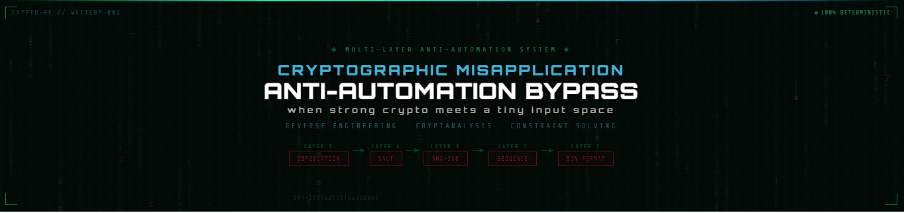

---

# Comprehensive Security Assessment: Multi-Layer Anti-Automation System

> **Category:** Reverse Engineering · Cryptanalysis &nbsp;|&nbsp; **Layers Defeated:** 5 &nbsp;|&nbsp; **Execution Time:** <1 second &nbsp;|&nbsp; **Tools:** Ghidra · GDB · Python

---

## Executive Summary

A five-layer anti-automation system — complex binary format, sequence validation, SHA-256 hashing, cryptographic salting, and intermediate obfuscation — was fully compromised in under one second. Not through a flaw in the cryptographic primitives, but through a single architectural mistake: **client-side validation with an accessible secret**.

Every layer collapsed not because SHA-256 is weak, but because all five layers were protecting the wrong thing.

**Key skills demonstrated:**
- Binary format reverse engineering (Ghidra + GDB)
- Cryptanalysis of constrained input spaces
- Constraint satisfaction problem solving
- Fully automated exploitation pipeline

---

## Target Overview

The system implements a Bulls and Cows number-guessing game with a unique rule: the player must win exclusively on their *final* permitted attempt. This forces a specific playthrough pattern — every intermediate guess must produce a predetermined feedback sequence — which the system validates cryptographically.

### Security Architecture

```
Layer 5  →  Intermediate obfuscation (unused data sections)
Layer 4  →  Cryptographic salting    (16-byte random salt per record)
Layer 3  →  SHA-256 hashing          (pattern validation)
Layer 2  →  Sequence validation      (per-attempt feedback verification)
Layer 1  →  Complex binary format    (multi-section variable-length records)

          ⚠  Fundamental flaw: client-side validation architecture
```

All five layers are visible and accessible from the client. Compromising the architecture compromises everything above it simultaneously.

---

## Phase 1 — Binary Format Reconstruction

### Structure Analysis

Static analysis with Ghidra revealed a deterministic multi-section record format:

```
RECORD LAYOUT
─────────────────────────────────────────────────────
SECTION 1: Header (32 bytes, fixed)

  +0x00  [4 bytes]   entry_id       Game record identifier
  +0x04  [2 bytes]   max_attempts   Attempt limit
  +0x06  [2 bytes]   num_digits     Code length (always 4)
  +0x08  [16 bytes]  salt           Random salt
  +0x18  [2 bytes]   secret_code    The target secret (plaintext)
  +0x1A  [6 bytes]   padding        Alignment

SECTION 2: Intermediate data (variable, unused)

  Size: (max_attempts - 1) × 2 bytes
  Role: Obfuscation — not read during validation

SECTION 3: Validation hashes (variable)

  Size: (max_attempts - 1) × 32 bytes
  Each: SHA-256(salt || pattern_string)
  Where pattern_string = "XXC YYB" (XX = cows, YY = bulls)

TOTAL: 32 + (attempts - 1) × 34 bytes
─────────────────────────────────────────────────────
```

### Key Findings

- The secret code is stored **in plaintext** at offset `+0x18` — direct extraction, no cryptanalysis needed
- Section 2 (obfuscation) is parsed but never read during validation — zero security value
- No integrity protection: no HMAC, no signature, no tamper detection
- Clear section boundaries make parsing deterministic after a single analysis session

---

## Phase 2 — Cryptographic Analysis

### Hash Validation Mechanism

Each attempt's feedback is validated by computing `SHA-256(salt || pattern)` and comparing against the stored hash. Reverse engineered from the binary:

```c
void validate_attempt(uint8_t *salt, char *pattern, uint8_t *expected_hash) {
    uint8_t computed[32];
    SHA256_CTX ctx;
    sha256_init(&ctx);
    sha256_update(&ctx, salt, 16);      // 16-byte salt
    sha256_update(&ctx, pattern, 6);    // "XXC YYB"
    sha256_final(&ctx, computed);
    if (memcmp(computed, expected_hash, 32) != 0) {
        printf("Invalid playthrough!\n");
        exit(1);
    }
}
```

### The Critical Flaw: Input Space of 25

SHA-256 is computationally secure — in the right context. Here, the input is a pattern of the form `"XXC YYB"` where cows + bulls ≤ 4. The entire input space:

| Cows | Bulls | Pattern  |
|------|-------|----------|
| 0    | 0     | `00C00B` |
| 0    | 1     | `00C01B` |
| ...  | ...   | ...      |
| 4    | 0     | `04C00B` |
| **Total: 25 combinations** | | |

Brute-forcing all 25 candidates takes approximately **3–4 microseconds** per hash. The salt — which is stored alongside the hash in the same readable binary — provides no meaningful protection at this scale.

### Why Salting Failed Here

| Aspect | Intended use (password hashing) | This implementation |
|--------|----------------------------------|---------------------|
| Input space | ~95¹⁰ (astronomically large) | 25 (enumerable in microseconds) |
| Salt accessibility | Public — that's fine for large spaces | Stored in client-readable binary |
| Attack type | Must guess from huge space | Enumerate entire space in real time |
| Salt benefit | Prevents rainbow tables | None — real-time brute force trivially feasible |

**The principle:** Salts protect against *precomputation*. When the input space is small enough for real-time enumeration, and the salt is accessible, salting adds no security.

---

## Phase 3 — Constraint Solving

Cracking the hash reveals the required feedback pattern `(cows, bulls)` for each attempt. The remaining problem is finding a guess that produces exactly that feedback against the known secret — a constraint satisfaction problem.

**Search space:** P(10, 4) = 5,040 permutations of 4 distinct digits  
**Average guesses tested per attempt:** ~2,500  
**Time per attempt:** <100ms  

The solver iterates through permutations until it finds a guess `G` such that `feedback(G, secret) == (target_cows, target_bulls)`.

---

## Complete Exploitation Flow

```
1. READ binary file
   └─ Parse record matching session entry_id
   └─ Extract: salt, secret (plaintext), validation hashes

2. CRYPTOGRAPHIC ATTACK (per attempt, ~3μs each)
   └─ Enumerate all 25 (cows, bulls) patterns
   └─ Compute SHA-256(salt || pattern) for each
   └─ Match against stored hash → reveals required feedback

3. CONSTRAINT SOLVING (per attempt, <100ms each)
   └─ Search 5,040 permutations
   └─ Find guess producing exact (cows, bulls) feedback
   └─ Against the known plaintext secret

4. AUTOMATED PLAYTHROUGH
   └─ Submit calculated guesses for attempts 1 through N-1
   └─ Submit correct secret on final attempt

5. RESULT
   Total execution time: <1 second
   Success rate: 100% (fully deterministic)
```

---

## Root Cause: Architectural Trust Boundary Violation

The system's failure isn't cryptographic — it's architectural.

```
CURRENT (VULNERABLE) DESIGN
─────────────────────────────────────────────────────
Client machine:
  ┌─────────────────────────────────────────┐
  │  Game binary                            │
  │  ├─ Validation logic      ← readable   │
  │  ├─ Secret loading        ← readable   │
  │  └─ Hash verification     ← readable   │
  └─────────────────────────────────────────┘
           │ reads
  ┌─────────────────────────────────────────┐
  │  gamefile.bin                           │
  │  ├─ Secrets               ← plaintext  │
  │  ├─ Salts                 ← accessible │
  │  └─ Hashes                ← crackable  │
  └─────────────────────────────────────────┘

All security data accessible to the attacker.
Client-side trust boundary = no trust boundary.
─────────────────────────────────────────────────────
```

This is the analogy: *multiple locks on a door with no wall*. Complexity layered on top of a broken foundation doesn't produce security — it produces false confidence.

**Defense-in-depth requires independent layers protecting different attack vectors.** Here, all five layers sat on the same broken foundation and fell together.

---

## Security Recommendations

### Architectural Redesign

Move all validation server-side. The client should never receive:
- The secret code
- Validation hashes or salts
- Expected playthrough patterns
- Any data that would allow offline reconstruction of game state

The server accepts guesses, computes feedback, and returns *only* the result. Nothing else.

### Supporting Controls

**Rate limiting** — enforce minimum time between submissions to prevent automated rapid-fire guessing.

**Behavioral analysis** — flag statistically improbable patterns: submissions arriving with microsecond-consistent timing, or guesses that are optimal without any exploratory behavior.

**Correct cryptographic application** — cryptographic primitives are only meaningful with sufficiently large input spaces and properly managed secrets. SHA-256 on a 25-element space is not cryptography in any meaningful sense.

---

## Key Takeaways

**Complexity is not security.** Five layers of obfuscation, hashing, and salting all collapsed because they shared the same broken foundation. The attacker doesn't need to defeat all five layers — just the weakest structural assumption.

**Cryptographic strength depends on context.** SHA-256 is not weak. Applied to a 25-element input space with an accessible salt, it provides approximately 3 microseconds of protection. The primitive is fine; the application is not.

**Salts solve precomputation, not enumeration.** A salt prevents an attacker from building a lookup table in advance. It does not prevent computing all 25 hashes in real time.

**Client-side secrets are not secrets.** Anything the client binary can read, the attacker can read. If validation logic or secret data must live on the client, the security model is already broken by design.

---

## Tools

| Tool | Use |
|------|-----|
| Ghidra | Binary decompilation, format reconstruction, offset discovery |
| GDB | Dynamic analysis, runtime behavior verification |
| Python 3 + struct | Binary parsing and record extraction |
| Python 3 + hashlib | Hash brute-force (25-element space) |
| Python 3 + itertools | Constraint satisfaction over permutation space |

---

*Analysis conducted as part of an educational offensive security research program. All techniques are documented for defensive and research purposes.*
