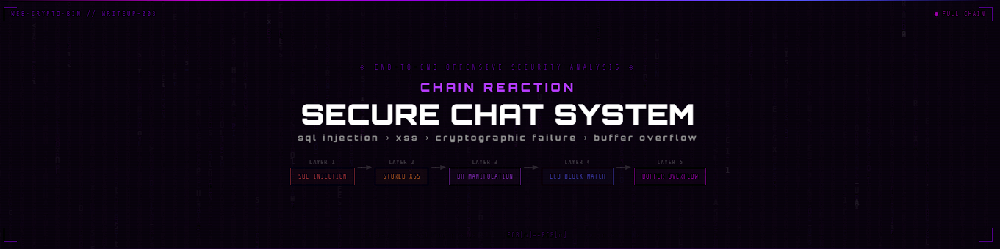

---

# Chain Reaction: Full Compromise of a Secure Chat System

> **Category:** Web · Cryptography · Binary Exploitation &nbsp;|&nbsp; **Vulnerabilities:** SQLi · Stored XSS · DH Manipulation · AES-ECB Oracle · Buffer Overflow &nbsp;|&nbsp; **Tools:** Burp Suite · Ghidra · GDB · Python

---

## Executive Summary

A secure messaging system hardened across multiple incremental security improvements was fully compromised through a five-stage attack chain. No single vulnerability was sufficient alone — each stage exploited a different vulnerability class, and each created the conditions that made the next stage possible.

The chain: SQL injection established a foothold → stored XSS gained code execution in the administrator's browser → Diffie-Hellman manipulation produced a predictable AES key → ECB block-matching recovered the encrypted plaintext → a buffer overflow in the native admin validator granted full administrative control.

**Key skills demonstrated:**
- Multi-vector attack chain design and execution
- Stored XSS as a delivery mechanism for cryptographic and binary attacks
- Cryptographic protocol abuse (unauthenticated Diffie-Hellman)
- AES-ECB deterministic block-matching oracle construction
- Browser-delivered buffer overflow exploitation

---

## Attacker Model

Starting position — no privileged access:
- Ability to register arbitrary user accounts
- Ability to post messages visible to other users
- Ability to exploit SQL injection in the login flow
- Ability to inject persistent JavaScript into other users' browsers

All privilege escalation flows directly from the system's flawed trust boundaries. Nothing is assumed beyond what the application itself exposes.

---

## Attack Chain Overview

```
Stage 1: SQL Injection
  └─ Bypass authentication, access any account
       │
       ▼
Stage 2: Stored XSS
  └─ Inject persistent JS into admin's browser
  └─ Gain arbitrary code execution client-side
       │
       ├──────────────────────┐
       ▼                      ▼
Stage 3: DH Manipulation    Stage 4: ECB Block-Matching
  └─ Force A=1 via XSS        └─ Recover encrypted plaintext
  └─ Shared secret = 1          one block at a time
  └─ AES key predictable        using username as oracle
       │                      │
       └──────────┬───────────┘
                  ▼
Stage 5: Buffer Overflow (via XSS)
  └─ Overflow native admin PIN validator
  └─ Full administrative control achieved
```

Each stage creates a dependency: without XSS, the DH manipulation and buffer overflow are unreachable. Without SQL injection, the encrypted ciphertext cannot be extracted. The system collapses as a chain, not as isolated vulnerabilities.

---

## Stage 1 — SQL Injection: Authentication Bypass

### Root Cause

The authentication workflow concatenates user input directly into SQL queries without parameterization.

### Impact

- Login as any existing user without credentials
- Access to chat interfaces required for later stages
- Extraction of encrypted chat records through a secondary injection point at `/user/{username}/modify`

SQL injection here is not just an authentication bypass — it is the mechanism that leaks the target ciphertext needed for Stage 4.

---

## Stage 2 — Stored XSS: Code Execution in the Admin's Browser

### Root Cause

User-controlled message content is inserted into the DOM without sanitization. Injected scripts persist across sessions and execute in every browser that views the affected message — including the administrator's.

### Role in the Chain

Stored XSS is the **pivot point** of the entire attack chain. It transforms a web vulnerability into a delivery mechanism for two completely different attack classes:

- **Stage 3:** The injected script intercepts and modifies the Diffie-Hellman key exchange before Alice's browser processes it
- **Stage 5:** The injected script issues a crafted request with a malicious `admin_pin` payload, delivered with the admin's valid session credentials automatically attached by the browser

Without persistent XSS, both the cryptographic attack and the binary exploitation would be unreachable.

---

## Stage 3 — Diffie-Hellman Parameter Manipulation: Predictable AES Key

### Root Cause

The secure chat protocol relies on Alice's browser to automatically parse incoming messages, extract Diffie-Hellman public parameters, and respond with her own DH value. The parameters are never authenticated.

### Attack

The injected script intercepts the DH exchange and forces Alice to transmit:

```
A = 1
```

Since the server performs no parameter validation, the shared secret becomes:

```
1^x mod p = 1
```

The AES session key derived from this output is fully predictable regardless of the server's private exponent.

### What This Is (and Isn't)

This is not a cryptographic break of Diffie-Hellman. The math is sound. The failure is the system's **lack of parameter authentication** — DH without authentication cannot resist a man-in-the-middle or, in this case, a script running inside the participant's own browser. Combined with the system's reliance on the browser as a trusted security component, the protocol collapses.

---

## Stage 4 — AES-ECB Block-Matching Oracle: Plaintext Recovery

### Root Cause

The system encrypts chat records using AES-ECB. Three design decisions combine into a complete decryption oracle:

1. **Attacker-controlled plaintext:** Username fields pass directly through the encryption routine
2. **Ciphertext exposure:** The resulting ciphertext is accessible through a dedicated endpoint
3. **ECB determinism:** Identical plaintext blocks always produce identical ciphertext blocks

SQL injection (Stage 1) provides the ciphertext of the target encrypted message.

### Attack: Deterministic Block-Matching

This is not a padding oracle attack. It is a **controlled plaintext alignment attack** unique to ECB mode.

```
For each unknown byte at position N:
  1. Craft a username that places one candidate byte
     at the exact block boundary
  2. Rename the account → encryption routine runs
  3. Extract the resulting ciphertext block
  4. Compare against the corresponding block
     from the target ciphertext
  5. Matching blocks → byte is confirmed

Repeat for each byte of the target message.
```

The attack works because ECB encrypts each 16-byte block independently with no chaining or IV. An attacker who can encrypt arbitrary plaintext and observe ciphertext can recover any target plaintext that shares an encryption key — one byte at a time.

### Why ECB Fails Here

AES-ECB's core property — identical inputs always produce identical outputs — is precisely what makes it dangerous when:
- The attacker controls any portion of the plaintext
- The ciphertext is observable
- The key is reused across different encryptions

All three conditions hold here.

---

## Stage 5 — Buffer Overflow via XSS: Administrative Takeover

### Root Cause

Administrative operations require submitting an `admin_pin` field to a native binary that performs validation. The binary does not enforce bounds on its input buffer, allowing a stack buffer overflow that overwrites the return address and bypasses the PIN check entirely.

### Delivery

The overflow payload is not submitted directly — it is delivered through the injected script running inside the administrator's browser. The script constructs the malicious request with the overflow payload as the `admin_pin` value. Because it executes in the admin's browser context, the browser automatically attaches valid session credentials.

The server receives a legitimately authenticated request carrying an overflow payload. The native binary processes it and is overflowed.

### Impact

- Full administrative control
- Ability to rename arbitrary users (enabling continued ECB oracle queries)
- Complete compromise of system integrity and confidentiality

---

## Cross-Layer Failure Analysis

### The Browser as a Trusted Security Component

The system's most consequential architectural mistake is treating the browser as a trustworthy participant in security-critical operations. The DH key exchange and administrative PIN submission both depend on the browser behaving correctly. Once XSS grants an attacker execution inside that browser, every operation the browser performs becomes attacker-controlled.

**Any system where client-side compromise equals security compromise has no meaningful security boundary.**

### Cryptographic Failures

| Issue | Consequence |
|-------|-------------|
| Unauthenticated Diffie-Hellman | Shared secret controllable by an in-browser attacker |
| AES-ECB mode | Deterministic encryption enables block-matching oracle |
| No message integrity (MAC) | Ciphertext manipulation undetected |

### Compounding Architecture

Each hardening step the system applied introduced new assumptions rather than eliminating the root causes. SQL injection was not fixed before DH was added. XSS sanitization was not implemented before cryptographic operations were moved client-side. The result is a system where every layer's security depends on the one below it — and the lowest layer was already broken.

---

## Key Takeaways

**The browser is not a trust boundary.** Stored XSS demonstrates that any security guarantee requiring correct browser behavior evaporates once an attacker can execute JavaScript in that context. Cryptographic operations and administrative actions must be validated server-side, independent of client behavior.

**AES-ECB is not encryption for variable-length structured data.** Its determinism is a feature that becomes a vulnerability the moment an attacker can influence plaintext and observe ciphertext. CBC, GCM, or any mode with an IV prevents this attack class entirely.

**Authentication is not optional in key exchange.** Diffie-Hellman establishes a shared secret — it does not authenticate who is on the other end. Without parameter authentication (via digital signatures or a trusted third party), any participant in the channel can manipulate the exchange. Here, the "participant" was an attacker script.

**Chained exploits compound.** None of the five vulnerabilities alone would have achieved full compromise. Together, they form a path from unauthenticated visitor to full administrative takeover. Fixing any single layer without addressing the others leaves the chain intact at a different entry point.

**Fix root causes, not symptoms.** Each security hardening step added complexity without addressing the architectural assumptions underneath. Parameterized queries, server-side validation, authenticated key exchange, and a secure encryption mode would each independently break multiple stages of this chain.

---

## Tools

| Tool | Use |
|------|-----|
| Burp Suite | HTTP interception, SQL injection, request manipulation |
| Browser DevTools | XSS payload development, DOM inspection |
| Ghidra | Native binary reverse engineering, overflow offset discovery |
| GDB | Dynamic analysis, stack inspection, overflow verification |
| Python 3 | ECB oracle automation, payload construction |

---

*Analysis conducted as part of an educational offensive security research program. All techniques documented for defensive and research purposes in an authorized environment.*
