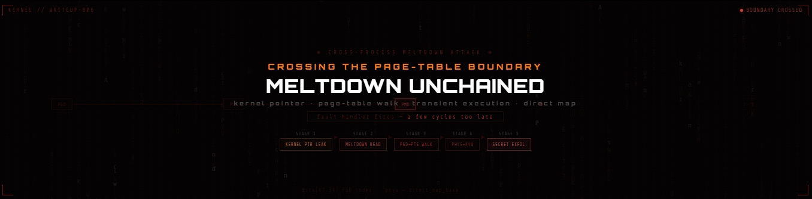
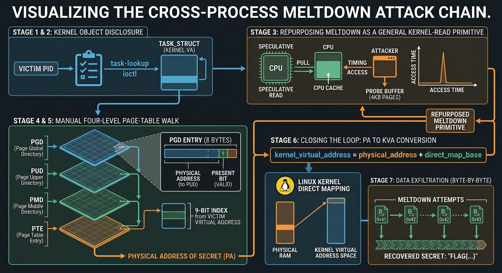

---

# Crossing the Page-Table Boundary: A Cross-Process Meltdown Attack via Kernel Pointer Disclosure

> **Category:** Kernel Exploitation · Microarchitectural Attack &nbsp;|&nbsp; **Technique:** Kernel pointer leak · manual page-table walk · Meltdown transient execution · direct-map remapping &nbsp;|&nbsp; **Prerequisites:** KPTI disabled (`nopti`)

---

> *Every safeguard in this exploit — the page table, the fault handler, the privilege check — behaved exactly as designed. The isolation boundary didn't fail to stop the read; it stopped it a few cycles too late to stop the damage. The kernel's own bookkeeping, built to keep processes apart, becomes the very thing that leads back to the process it was protecting. The mechanism meant to guard the secret is what ends up exposing it.*

---

## Summary

Three distinct areas of systems security chained into a single attack: kernel object disclosure, virtual-to-physical address translation, and microarchitectural side-channel exploitation.

A victim process held a secret in a userspace buffer at a known virtual address — but that address had no meaning outside the victim's own page tables. A kernel module leaked a raw pointer to the victim's `task_struct`. From there the exploit walked the kernel's internal memory-management structures by hand, resolved the victim's page tables, and translated the secret's virtual address into a physical one.

The physical address alone was still not directly attackable — Meltdown reads through virtual addresses, not physical ones. The exploit closed the loop using the kernel's direct physical-memory mapping to convert the recovered physical address back into a kernel virtual address. Only then could Meltdown read the secret itself, one byte at a time, through a cache-timing covert channel.

**The central lesson:** the interesting part was not "perform Meltdown" — that primitive was already established. The challenge was locating *what* to attack in the first place.

---

## Environment

| Condition | Detail |
|-----------|--------|
| KPTI | Disabled (`nopti`) — required for classic Meltdown from userspace |
| Kernel primitives | Task-lookup ioctl (PID → `task_struct` KVA) · kernel-touch ioctl (warms target cache line) |
| Victim | Child process; secret in a fixed userspace buffer, continuously touched (kept resident) |
| Attacker capability | Userspace shellcode; no kernel modules; no direct kernel memory access |

---

## Attack Chain

```
Victim PID
   │  task-lookup ioctl
   ▼
task_struct  (kernel virtual address)
   │  Meltdown read @ +mm_offset
   ▼
mm_struct  (kernel virtual address)
   │  Meltdown read @ +pgd_offset
   ▼
PGD  (page-table root)
   │  four-level page-table walk via Meltdown reads
   ▼
Physical address of the secret
   │  + kernel direct-map base
   ▼
Kernel virtual address of the secret
   │  Meltdown read, byte by byte
   ▼
Recovered secret
```

---

## Stage 1 — Locating the Secret's Virtual Address

Static analysis of the victim binary identified the exact virtual address of its secret buffer. This address only has meaning inside the victim's own address space — the attacker's process maps something completely different at the same numerical address.

It served only as the *destination* of a translation problem. The real starting point was resolving whose page tables to walk and how to reach them.

---

## Stage 2 — From PID to Kernel Pointer

The victim was spawned as a child of the exploit, providing its PID. The kernel module's task-lookup ioctl accepted that PID and returned the kernel virtual address of the victim's `task_struct` — the kernel's internal bookkeeping structure for the process, which holds a pointer to its memory-management state.

The attacker now held a kernel pointer with no ordinary way to dereference it. Dereferencing kernel memory from userspace is exactly what page-table permissions prevent. That is where Meltdown comes in.

---

## Stage 3 — Meltdown as a Generic Kernel-Read Primitive

The transient-execution mechanics of Meltdown were repurposed here as a general-purpose **"read 8 bytes from any kernel address"** primitive, built by issuing eight independent single-byte transient reads.

Each single-byte read:

```
1. Kernel-touch ioctl warms the target address in cache
   (improves the race window odds)

2. Transient instruction sequence:
   · speculatively reads target byte before permission check completes
   · uses byte value to index into probe buffer:
     probe[byte × 4096] is accessed, pulling that page into cache
   · architectural rollback occurs — the illegal read is undone
   · the cache state is NOT rolled back

3. Flush+Reload:
   · time access to every page of the probe buffer
   · the page with anomalously fast access → reveals the byte
   · probe buffer fully flushed before next attempt
```

This turned a single-purpose Meltdown proof-of-concept into a **flexible kernel-memory oracle** — any kernel structure at a known address could now be read.

---

## Stage 4 — Walking Kernel Data Structures

With an 8-byte kernel read available, the exploit walked two well-known kernel relationships using struct-layout offsets determined through static analysis:

```
task_struct  →  mm_struct  →  PGD
```

Each step: one 8-byte Meltdown read at `base + known_offset`.

Result: the kernel virtual address of the root of the victim's own page tables — the PGD — which defines the complete mapping from the victim's virtual addresses to physical memory.

---

## Stage 5 — Manual Four-Level Page-Table Walk

x86-64 resolves a virtual address through four levels of page tables, using fixed bit ranges as indices at each level:

| Level | Bits  | Role |
|-------|-------|------|
| PGD   | 47–39 | Page Global Directory |
| PUD   | 38–30 | Page Upper Directory  |
| PMD   | 29–21 | Page Middle Directory |
| PTE   | 20–12 | Page Table Entry      |
| —     | 11–0  | Byte offset within page |

Starting from the PGD, the same pattern repeated four times:

```
1. Extract 9-bit index from victim's virtual address at this level
2. Meltdown read: fetch 8-byte entry at table_base + index × 8
3. Check present bit — confirm mapping is valid
4. Mask off flag bits → recover physical base of next table
5. Repeat at next level
```

The fourth entry — the PTE — points not to another table but to the physical page frame backing the victim's secret buffer. Combining the frame address with the low 12 bits of the original virtual address yields the **exact physical address of the secret**.

---

## Stage 6 — Physical Address to Kernel Virtual Address

Meltdown reads through virtual addresses. A bare physical address cannot be passed to the same primitive.

Linux maintains a **direct mapping**: a contiguous region of kernel virtual address space where every physical page of RAM is mapped 1:1 at a fixed, known offset. Converting physical to kernel virtual is a single addition:

```
kernel_virtual = physical_address + direct_map_base
```

This is the step that makes the chain coherent — it converts an address recovered *structurally* (via page-table walk) into something the Meltdown primitive can act on directly.

---

## Stage 7 — Reading the Secret

With a kernel virtual address mapping to the same physical memory as the victim's secret buffer, the Meltdown primitive iterated byte-by-byte across the expected secret length — filtering for printable characters and reconstructing the value incrementally until a terminating character confirmed completion.

---

## Address Space Transitions

Three distinct address spaces, explicitly converted between at each stage:

```
Victim virtual address
      │  meaningful only inside victim's page tables
      │  used as input to the page-table walk
      ▼
Physical address
      │  recovered from PTE after four-level walk
      │  not directly usable by the read primitive
      ▼
Kernel virtual address  (physical + direct_map_base)
      │  usable by Meltdown read primitive
      ▼
Secret bytes
```

Failing to track which address space is active at each step is the most common failure mode when building this kind of chain.

---

## Full Attack Chain

```
Victim PID
   │  task-lookup ioctl
   ▼
task_struct (kernel VA)
   │  Meltdown read @ +mm offset
   ▼
mm_struct (kernel VA)
   │  Meltdown read @ +pgd offset
   ▼
PGD (page-table root)
   │  four-level page-table walk (Meltdown reads)
   ▼
Physical address of the secret
   │  + kernel direct-map base
   ▼
Kernel virtual address of the secret
   │  Meltdown read, byte by byte
   ▼
Recovered secret
```


*Figure — the attack chain above, visualized stage by stage.*

---

## Key Takeaways

**A kernel pointer is a gateway, not just a value.** The leaked `task_struct` address was never useful on its own. Its value came entirely from what it let the exploit reach next: `mm_struct`, then the page-table root, then the victim's own memory mappings. Kernel pointer leaks matter because of their *reachability*, not their face value.

**Virtual and physical addresses are not interchangeable — and neither is "attacker-visible" and "target-relevant."** The secret's own virtual address was meaningless outside its process. The physical address recovered from the walk was meaningless to the read primitive. Real progress required explicitly converting between three address spaces at three different stages of the chain.

**Meltdown is a primitive, not a payload.** Treating the microarchitectural side channel as a general "read 8 bytes from any kernel address" building block — rather than a single-purpose exploit for one fixed value — is what made it possible to walk arbitrary kernel data structures at all. The reusability of the primitive was what made the entire chain feasible.

**Composability is the actual skill being tested.** A kernel pointer leak, a textbook page-table walk, and a known Meltdown gadget are each well-documented in isolation. The challenge was recognizing how they had to be sequenced and where each one's output became the next one's input.

**KPTI exists for a reason.** Kernel Page-Table Isolation directly defeats this attack class by ensuring kernel page-table entries are not present in userspace page tables during execution — eliminating the window in which speculative kernel memory access is possible. The `nopti` configuration requirement here is not incidental; it is the architectural precondition the entire attack depends on.

---

## Tools

| Tool | Use |
|------|-----|
| Ghidra/IDA | Victim binary static analysis, virtual address identification |
| GDB | Kernel struct offset recovery against matching kernel build |
| x86-64 Assembly | Meltdown gadget: speculative read, Flush+Reload probe |
| C | Exploit harness, ioctl interface, byte reconstruction loop |

---

*Analysis conducted as part of an educational offensive security research program. All techniques documented for research and defensive purposes in an authorized environment.*
