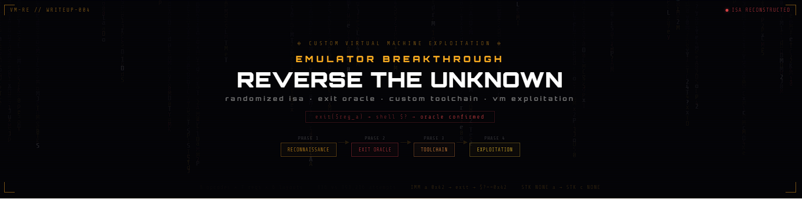

---

# Emulator Breakthrough: Reverse Engineering a Randomized Virtual Machine

> **Category:** Reverse Engineering · VM Exploitation &nbsp;|&nbsp; **Core Technique:** Exit Code Oracle · ISA Reconstruction · Custom Toolchain &nbsp;|&nbsp; **Tools:** Ghidra · GDB · Python

---

## Executive Summary

A custom virtual machine with a fully randomized Instruction Set Architecture was compromised through four phases: static reconnaissance, exit code oracle exploitation, automated toolchain development, and constrained multi-stage payload execution.

The central insight — that the VM's exit syscall leaked internal register state through the process exit code — transformed an opaque black box into a transparent oracle. Combined with static analysis to constrain the search space, this reduced ISA reconstruction from 393,216 blind attempts to a maximum of **336 targeted probes**.

**Key skills demonstrated:**
- Black-box reverse engineering of a custom ISA
- Side-channel information disclosure via process exit codes
- Custom assembler/disassembler development for a non-standard architecture
- Register-constrained multi-stage shellcode design
- Static analysis to bound dynamic search spaces

---

## Target Overview

The target implements a virtual machine emulator with the following characteristics:

- **Custom ISA**: 8 opcodes with randomized byte encodings per challenge instance
- **3-byte instruction format**: Opcode and two arguments in randomized positional order
- **Register-based architecture**: 7 registers (general-purpose, stack pointer, instruction pointer, flags)
- **Memory-mapped I/O**: Syscall interface for file operations
- **Full randomization**: Each instance independently shuffles opcode values, register encodings, and instruction byte ordering

Every instance is a different language. The bytecode from one run is meaningless in another.

---

## Phase 1 — Reconnaissance and Static Analysis

### Locating the VM Loop

Ghidra's decompiler revealed the fetch-decode-execute loop — the structural core of any emulator:

```c
byte bVar1;
do {
    bVar1 = *(byte *)(vm_state + 0x405);
    *(byte *)(vm_state + 0x405) = bVar1 + 1;
    interpret_instructions(vm_state, *(uint3 *)((long)(int)(uint)bVar1 * 3 + vm_state));
} while (true);
```

VM registers are stored at fixed offsets from a base pointer — but those offsets change between instances, requiring dynamic discovery.

### Instruction Format Analysis

Each 3-byte instruction packs three components, but their **positional ordering is randomized** across six possible layouts:

```
op|a1|a2    a1|op|a2    a2|a1|op
a1|a2|op    a2|op|a1    op|a2|a1
```

Without knowing the layout, raw bytecode is uninterpretable.

### GDB Under SUID Restrictions

The binary runs with SUID permissions, which blocks standard debugging workflows — no process attachment, no runtime breakpoints. GDB was used instead in static inspection mode:

```bash
gdb ./vm_binary
info sections
x/100bx 0x<rodata_address>     # Scan for opcode/register candidate values
find 0x<start>, 0x<end>, 0x1, 0x2, 0x4, 0x8
disassemble <function_address>
```

This yielded:
- Opcode candidate values from lookup tables in `.rodata`
- Register offset mappings from VM initialization code
- Syscall dispatch tables with syscall number candidates

Static analysis alone cannot confirm which candidate maps to which semantic. That required an oracle.

---

## Phase 2 — The Exit Oracle: Information Disclosure via Exit Code

### Vulnerability Discovery

Analysis of the syscall dispatcher in Ghidra revealed a critical design flaw in the exit handler:

```c
// Syscall dispatcher
if ((syscall_mask & current_instruction) != 0) {
    exit_sys(vm_state, *(undefined1 *)(vm_state + 0x400));
}

// Exit syscall implementation
void exit_sys(undefined8 param_1, int param_2) {
    exit(param_2);   // VM register value passed directly to native exit()
}
```

The VM passes a register value directly to the native `exit()` call. On Unix systems, the process exit code is externally readable via `$?`.

### The Oracle

```
VM Register A  →  exit(value)  →  shell $?  →  external observer
```

By loading a known marker value into a register and triggering exit, the shell exit code confirms whether the encoding was correct:

```
IMM <opcode_candidate> <reg_candidate> 0x42
SYS <exit_opcode> <reg_a>

→ if echo $? == 0x42: opcode confirmed, register confirmed, layout confirmed
```

A single successful probe simultaneously reveals three unknowns: the `IMM` opcode encoding, the register A encoding, and the instruction byte ordering.

### Targeted Search Space

Static analysis identified the candidate sets before any dynamic probing:

| Component | Candidates | Count |
|-----------|-----------|-------|
| Opcodes (IMM, ADD, STK, STM, LDM, CMP, JMP, SYS) | Power-of-two byte values | 8 |
| Registers (a, b, c, d, s, i, f) | Power-of-two byte values | 7 |
| Instruction layouts | All positional orderings | 6 |

**Blind brute force:** 256 × 256 × 6 = 393,216 attempts  
**Targeted approach:** 8 × 7 × 6 = **336 maximum attempts** — a ~1,000x reduction

Once `IMM` and register A were confirmed, remaining opcodes were discovered by loading test values, performing operations, and leaking results through exit — inferring each opcode's semantics from observed behavior.

---

## Phase 3 — Automated Toolchain Development

Manual hex-editing is infeasible for multi-stage VM payloads. A purpose-built assembler was necessary.

### The Core Challenge: Six Possible Layouts

```python
ORDER_MAPS = {
    "op_a1_a2": {"opcode": 0, "arg1": 1, "arg2": 2},
    "a1_op_a2": {"arg1": 0, "opcode": 1, "arg2": 2},
    "a2_op_a1": {"arg2": 0, "opcode": 1, "arg1": 2},
    "a2_a1_op": {"arg2": 0, "arg1": 1, "opcode": 2},
    "a1_a2_op": {"arg1": 0, "arg2": 1, "opcode": 2},
    "op_a2_a1": {"opcode": 0, "arg2": 1, "arg1": 2}
}

CURRENT_ORDER = "a2_a1_op"  # Single variable — update per instance

def pack_layout(v_op, v_a1, v_a2):
    layout = ORDER_MAPS[CURRENT_ORDER]
    result = [0, 0, 0]
    result[layout["opcode"]] = v_op
    result[layout["arg1"]]   = v_a1
    result[layout["arg2"]]   = v_a2
    return bytes(result)
```

Changing `CURRENT_ORDER` is the only update needed to retarget a new instance — every payload reassembles correctly from the same source.

### Assembly Syntax

```asm
IMM a 0x2f          ; Load '/' into register a
STM *d a            ; Store: memory[d] = a
STK NONE b          ; Push register b onto stack
STK c NONE          ; Pop stack into register c
SYS 0x4 a           ; invoke open() syscall
JMP E i             ; Jump if equal flag set
```

### Disassembler and Interpreter

A full VM interpreter was built alongside the assembler to decode bytecode into readable assembly and simulate register/memory state transitions:

```
0000: [A=0x00 B=0x00 C=0x00 D=0x00 S=0x00 I=0x00 F=0x00]
      IMM a 0x2f
  [EXEC] Loaded 0x2f into register a

0003: [A=0x2f B=0x00 C=0x00 D=0x00 S=0x00 I=0x01 F=0x00]
      STM *d = a
  [EXEC] Memory[0x00] = 0x2f
```

Payload verification before deployment — essential when there is no runtime debugger.

---

## Phase 4 — Exploitation Under Register Constraints

### The Problem: Multi-Stage Syscalls with Limited Registers

Reading a file requires three sequential syscalls:

```
open(path)  →  read(fd, buffer, size)  →  write(stdout, buffer, size)
```

The constraint: `open()` returns a file descriptor into a register. Preparing `read()` arguments requires reusing that same register — destroying the fd before it can be used.

With only 4–7 general-purpose registers and no automatic spilling, this requires deliberate state management.

### Solution: Stack-Based State Preservation

```asm
; ── Stage 1: Build path string in memory ──────────────────
IMM d 0x00
IMM a 0x2f          ; '/'
STM *d a
IMM d 0x01
IMM a 0x66          ; 'f'
STM *d a
IMM d 0x02
IMM a 0x6c          ; 'l'
STM *d a
IMM d 0x03
IMM a 0x61          ; 'a'
STM *d a
IMM d 0x04
IMM a 0x67          ; 'g'
STM *d a

; ── Stage 2: Open file ────────────────────────────────────
IMM a 0x00          ; filename pointer
SYS 0x4 a           ; open() → fd lands in register a

; ── Stage 3: Preserve fd immediately ─────────────────────
STK NONE a          ; PUSH fd onto VM stack

; ── Stage 4: Prepare read() arguments ────────────────────
IMM a 0x00          ; buffer address
IMM b 0x40          ; read size
STK c NONE          ; POP fd from stack into register c

; ── Stage 5: Read ─────────────────────────────────────────
SYS 0x8 c           ; read(fd, buffer, size)

; ── Stage 6: Write to stdout ──────────────────────────────
IMM a 0x01          ; stdout
IMM b 0x00          ; buffer address
IMM c 0x40          ; size
SYS 0x1 a           ; write(stdout, buffer, size)
```

The critical technique: **push the fd immediately after `open()` returns**, before any register is recycled. This preserves the value across the register pressure created by `read()` argument setup.

### What Made This Difficult

- No runtime debugger — verification relied entirely on the disassembler/interpreter
- Syscall argument register mappings vary between syscalls, requiring careful tracking
- Payloads cannot be reused across instances — full reassembly required each time
- Register pressure compounds across stages; ordering decisions cascade

---

## Key Takeaways

**Emulators are just programs — their interfaces leak.** The exit code oracle demonstrates that side channels exist even inside virtualized environments. Any interface that reflects internal state to an external observer is a potential information disclosure path — this applies equally to JavaScript VMs, hypervisors, and sandboxed runtimes.

**Static analysis bounds dynamic search.** Blind brute force over 393,216 combinations would have been slow and noisy. Static analysis of candidate value sets reduced the space to 336 targeted probes. The two techniques are complementary — static analysis sets the boundaries, dynamic analysis confirms them.

**Automation is non-negotiable for complex payloads.** The assembler/disassembler wasn't a convenience — it was a requirement. Multi-stage payloads across a non-standard ISA cannot be constructed or verified by hand at any reliable scale.

**Register constraints force explicit state management.** Unlike x86 with deep stacks and many registers, constrained environments require treating register allocation as a first-class design problem. The stack pivot technique here maps directly to skills used in ROP chain construction and size-constrained shellcode development.

**Every interface is an attack surface.** The exit syscall appeared innocuous — a normal program termination mechanism. It became the linchpin of the entire ISA reconstruction. Exhaustive analysis of all program interfaces, including seemingly benign ones, is what separates systematic research from surface-level scanning.

---

## Tools

| Tool | Use |
|------|-----|
| Ghidra | Decompilation, VM loop identification, syscall handler analysis |
| GDB | Static binary inspection under SUID restrictions |
| Python 3 | Oracle automation, assembler, disassembler, interpreter |
| pwntools | Process interaction and payload delivery |

---

*Analysis conducted as part of an educational offensive security research program. All techniques documented for defensive and research purposes in an authorized environment.*
